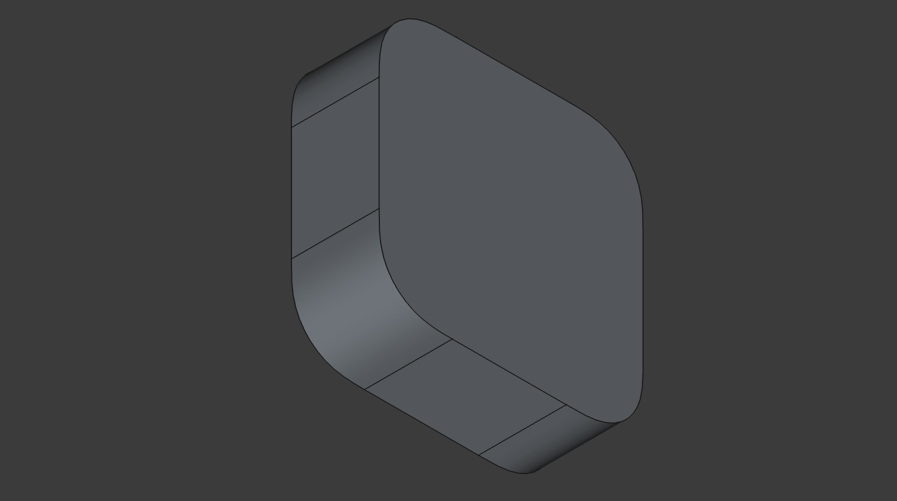
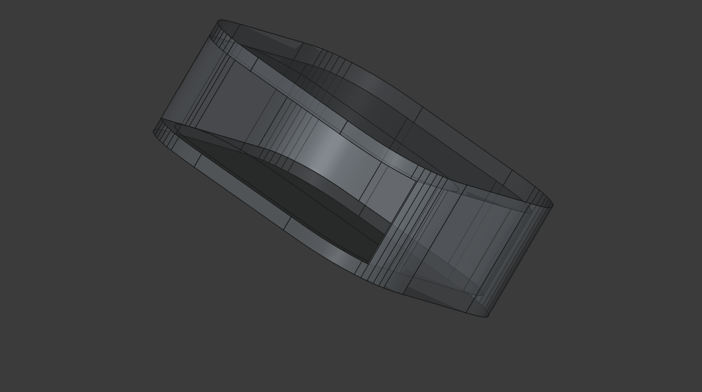

# Introduction

Work in Progress
----------------

Pictures will be added once completed.

This collection of scripts constructs an AppleTV 4k (3rd gen) VESA mount, held by a single screw. Eventually, I plan to use this to connect two devices
together vertically, one connected to the top of a VESA mount, one to the bottom, in betweem some plastic to hold both things together, for a X by 200mm VESA
system.

The construction of the AppleTV mount is split into multiple scripts. To enjoy the scripts from within FreeCAD, adjust `main.py` by changing
`sys.path.append("/path/to/repo")` to the location of this repository on your computer. Then open `main.py` with `File -> Open` in FreeCAD, go to
`Macro -> Execute Macro`, and you should end up with the model of an AppleTV mount.

# Terminology

| Word   | Meaning |
| ------ | ------- |
| Front  | Side facing away from TV |
| Back   | Side attached to TV with a screw |
| Top    | Side where AppleTV is inserted |
| Bottom | Where gravity goes from top side |
| Left   | Left, when viewed from the front, with top being at the top |
| Right  | Right, when viewed from the front, with top being at the top |

# Goals of the design

## Do's

- Create as few faces as possible
- Create a single large piece
- Remove what does not belong to the piece
- Fix float errors as they appear
- Close wiring that opened during offsetting
- Fuse faces as early as possible

## Don'ts

- Avoid construction by addition

# How it works

## appletv.py

As consumer 3d printers are not capable of high precision, a tolerance parameter is introduced to adjust the size of a fake AppleTV. First a 2d perimeter of
the official specification for the device is constructed. This perimeter is extended by the tolerance. The 2d perimeter is then extruded to `device height +
2*tolerance`.

Result: A 3d model of an AppleTV, that can be cut from an enclosure to fit in an AppleTV.

## mount.py

The parameter for the mount is the desired thickness of the resulting mount. My desired thickness is based on the screws I use to connect the mount my TV.
I use countersunk M6 screws. The depth of the screw head is 3.3mm. To avoid scratching the AppleTV, and to avoid thin walls at the position of the screw,
1mm is added, 0.5mm front, 0.5mm back.

The mount uses the 2d perimeter with tolerances, extendeds it by the desired thickness, extrudes it to `AppleTVs height + 2*thickness`,  and cuts the AppleTV
from its center, leaving you with a full shell with nicely rounded corners where nothing can be inserted. Lastly, the top is removed by translating the AppleTV a bit
and cutting again. This is where AppleTV would slide in.

## holes.py

Four additional holes must be created, if we want to allow the AppleTV to be oriented in any direction in the mount, which I would very much like.
I'd also like to not obstruct AppleTV's IR or LED. The goal is to have at least 0.5mm clearance for ports, IR and the LED indicator, as specified in Apples design guidelines.

For some reason the cutout also leads to some unexpected roundness. Replace the mini-AppleTV-cutout shape with its bounding box.

1. Bottom needs to be opened such that the AppleTV cannot glide through these hole, but ports can be accessed from any direction.
2. Left and right have issues. After cutting away the AppleTV from the case, the sides get too flimsy when just cutting a smaller variant. A bounding box will need to be created
that is as high, but not as wide, for a special cut.
3. The front needs to at least be somewhat open, in order to be able to access the screw.

For left, right, bottom front we thus need a 2d perimeter that is `thickness` smaller than AppleTV. If that is too large, and thus blocks ports, IR or the LED,
reduce size until it doesn't. Maximum thickness, with clearance, that does not block anything is 3.72 mm.

Visualization of issue with left and right cuts:

## screw.py

This script gets parameters for the screw types and tolerances. An M6 screw is modeled, and used to cut that screw at the center of the bottom side of the mount,
with `tolerance/2`  for either face of the bottom. The tolerance part at the front face of the bottom is then cut as a circle from the screw's front to the from
of the bottom shell, to have the screw a bit inset.

## main.py

Ties it all together. It queries all components for their parameters where required to pass those on to the next step.
Steps are executed in the order the other scripts are listed. Eventually it writes a STEP file with the result. All interim results are viewable within FreeCAD. 
