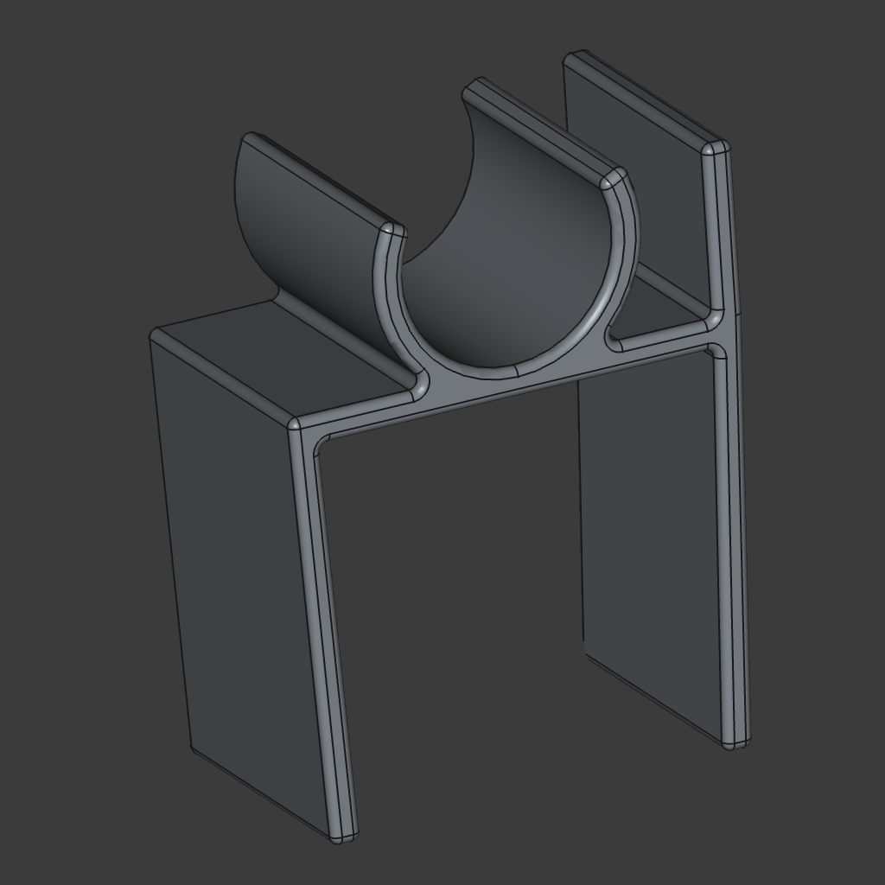

# CPAP Hose & Mask Holder

This is a simple yet effective CPAP hose holder, designed to keep your hose neatly organized while also offering an optional mask-hanging slot.

## Features

- **Two Versions:**
  - **Hose-only holder:** Provides a larger arc for a firm grip. Designed for long-term attachment, with easy removal only for cleaning.
  - **Hose & mask holder:** Features a smaller arc, allowing for effortless nightly removal.
- **Angled inward** to provide slight clamping force. Increase thickness if you need a stronger grip.
- **Designed for 3D printing**, with PETG recommended for long-term durability (PLA may lose its clamping force over time).
- **Optimized for FreeCAD** and includes a Python script to generate the models.

## Printing Recommendations

- **Material:** PETG (to maintain clamping force over time)
- **Layer Height:** 0.2 mm for good resolution
- **Infill:** 20-30% for durability
- **Supports:** Not required (design is support-free)

## Usage

- The **hose-only holder** stays in place, providing a stable grip on the hose.
- The **hose & mask holder** is meant to be removed each night before wearing the mask.

## Included Files

- **FreeCAD Python Script:** Generates both versions of the CPAP hose holder.
- **STEP files:** Ready for slicing in your preferred software.
- **Screenshots:** Preview images of the models.

## How to Use the Python Script

1. **Open FreeCAD**
2. **Load the script:**
   - Navigate to `File -> Open...` and select the Python script.
   - Alternatively, open the Python console (`View -> Panels -> Python Console`) and run the script manually.
3. **Adjust settings:** Modify the following parameters in the script to customize the model:
   - `includeMaskHolder`: `True` or `False` to enable/disable the mask holder slot.
   - `margin`: The thickness of the resulting model.
   - `height`, `width`, and `arc`: Customize the holder dimensions.
   - `innerDiameter`: Set according to the CPAP hose size.
   - `extrusionDepth`: Controls the depth of the holder.
4. **Run the script:** Press `Cmd+F6` or execute it via `Macro -> Execute Macro`.
5. **Step files** will be created in the `out` directory.

## Images

### Hose & Mask Holder  

### Hose-only Holder  

### Photograph of it in action

