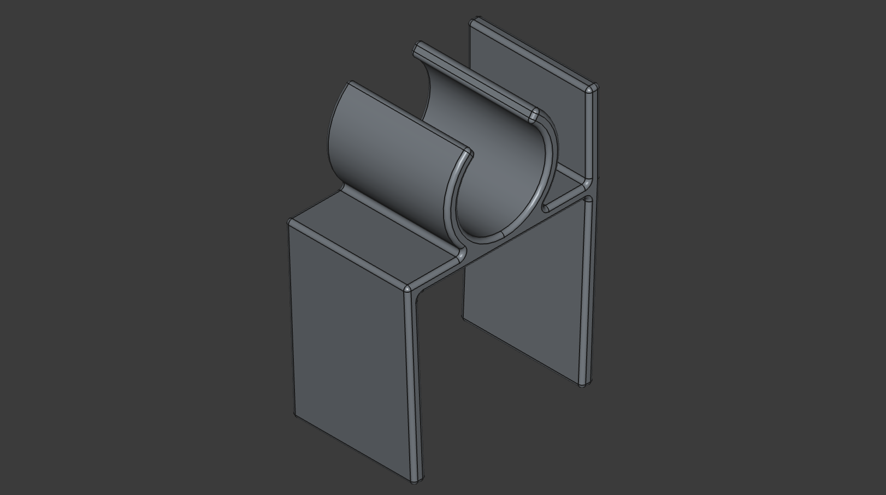
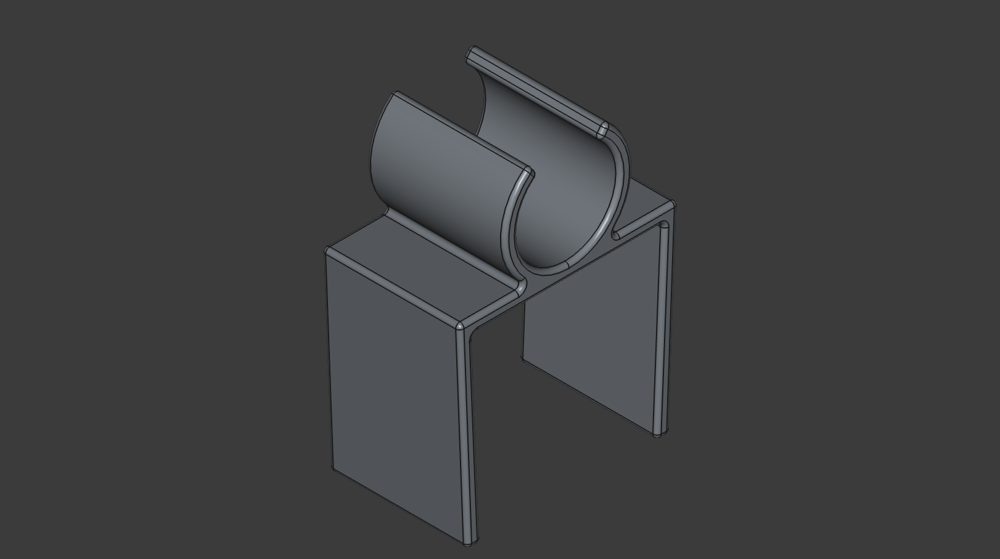

Simple CPAP hose holder, with optional slot to hang CPAP mask.

Angled inwards for some (low) amount of clamping force. Increase thickness for more force.

Print in PETG, as PLA will over time lose its clamping force.

