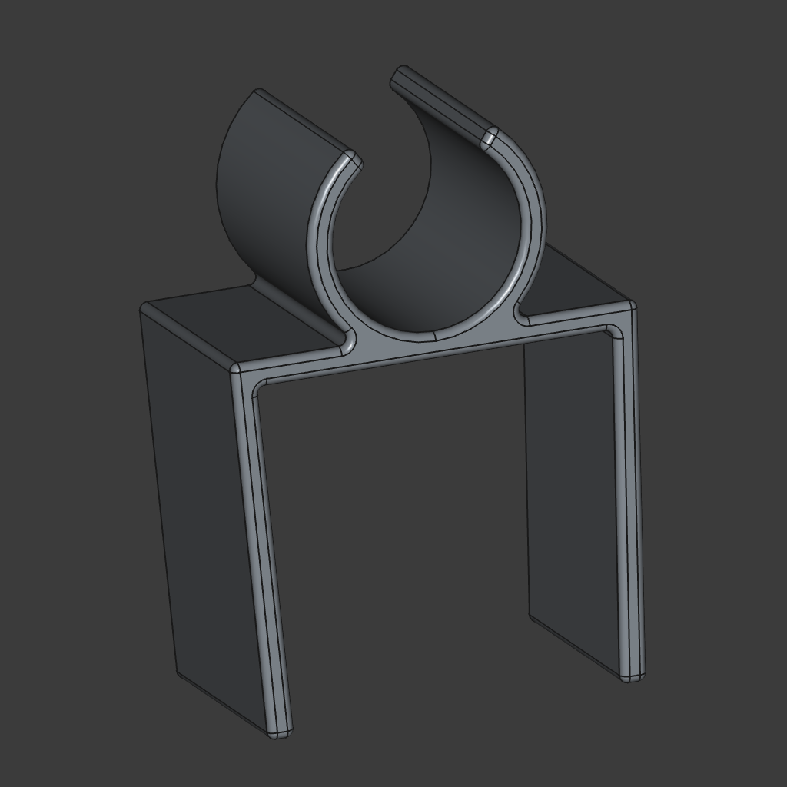

# CPAP Schlauch- & Maskenhalter

🌍 Verfügbare Sprachen:  
[🇩🇪 Deutsch](README.md) | [🇬🇧 English](README.en.md)

Dies ist ein einfacher, aber effektiver CPAP-Schlauchhalter, der Ihren Schlauch ordentlich organisiert hält und optional eine Aufhängung für die Maske bietet.

## Eigenschaften

- **Zwei Versionen:**
  - **Nur-Schlauch-Halter:** Bietet einen größeren Bogen für einen festen Halt. Entwickelt für langfristige Befestigung mit einfacher Entfernung nur zur Reinigung.
  - **Schlauch- & Maskenhalter:** Hat einen kleineren Bogen, der das einfache Entfernen des Schlauchs ermöglicht, sodass er jede Nacht entfernt werden kann.
- **Leicht nach innen geneigt**, um eine leichte Klemmkraft bereitzustellen. Erhöhen Sie die Dicke, wenn Sie eine stärkere Klemmkraft benötigen.
- **Optimiert für den 3D-Druck**, mit PETG für langfristige Haltbarkeit empfohlen (PLA verliert mit der Zeit die Klemmkraft).
- **Optimiert für FreeCAD** und enthält ein Python-Skript zur Generierung der Modelle.

## Druckempfehlungen

- **Material:** PETG (um die Klemmkraft langfristig zu erhalten)
- **Schichthöhe:** 0,2 mm für eine gute Auflösung
- **Infill:** 20-30% für Haltbarkeit
- **Supports:** Nicht erforderlich (Design ist stützfrei)

## Verwendung

- Der **Nur-Schlauch-Halter** bleibt an Ort und Stelle und bietet einen stabilen Halt für den Schlauch.
- Der **Schlauch- & Maskenhalter** ist so konzipiert, dass er jede Nacht entfernt werden kann, bevor die Maske aufgesetzt wird.

## Enthaltene Dateien

- **FreeCAD-Python-Skript:** Erzeugt beide Versionen des CPAP-Schlauchhalters.
- **STEP-Dateien:** Fertig zum Import in Ihre bevorzugte Slicer-Software.

## So verwenden Sie das Python-Skript

1. **FreeCAD öffnen**
2. **Das Skript laden:**
   - Navigieren Sie zu `Datei -> Öffnen...` und wählen Sie das Python-Skript aus.
   - Alternativ öffnen Sie die Python-Konsole (`Ansicht -> Panels -> Python-Konsole`) und führen das Skript manuell aus.
3. **Einstellungen anpassen:** Passen Sie die folgenden Parameter im Skript an, um das Modell zu konfigurieren:
   - `includeMaskHolder`: `True` oder `False`, um die Maskenhalterung zu aktivieren oder zu deaktivieren.
   - `margin`: Die Dicke des resultierenden Modells.
   - `height`, `width` und `arc`: Anpassung der Halterungsmaße.
   - `innerDiameter`: Einstellen entsprechend der Größe des CPAP-Schlauchs.
   - `extrusionDepth`: Bestimmt die Tiefe der Halterung.
4. **Skript ausführen:** Drücken Sie `Cmd+F6` oder führen Sie es über `Makro -> Makro ausführen` aus.
5. **STEP-Dateien** werden im Verzeichnis `out` erstellt.

## Bilder

### Schlauch- & Maskenhalter  

### Nur-Schlauch-Halter  

### Foto der Halterung in Aktion  
